# 🍔 Food Delivery App

A modern, scalable **food delivery application** built with Flutter and Firebase, following **Clean Architecture** and **BLoC state management**.

---

## 📌 Overview

This project simulates a real-world food delivery experience where users can browse meals, manage their cart, and place orders.

It was built to:

- Practice **scalable architecture (Clean Architecture)**
- Apply **BLoC for predictable state management**
- Integrate **Firebase services in a production-like app**

---

## 🌟 Key Highlights

- 🧱 Clean Architecture with feature-based modular structure
- 🔄 Reactive state management using BLoC
- 🔐 Secure authentication (Email + Google Sign-In)
- 🔔 Real-time notifications with Firebase Messaging
- ⚡ Optimized performance with caching and efficient state updates
- 📱 Fully responsive UI across multiple platforms

---

## 🎥 Demo

```
TODO
```

---

## 📱 Screenshots

### Onboarding

<p align="center">
  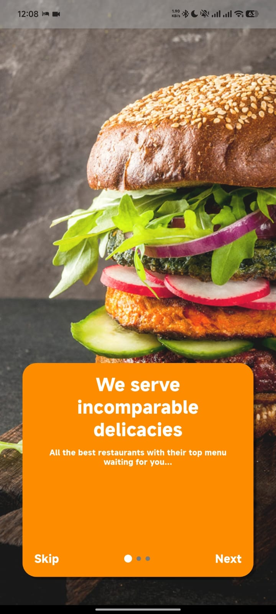
  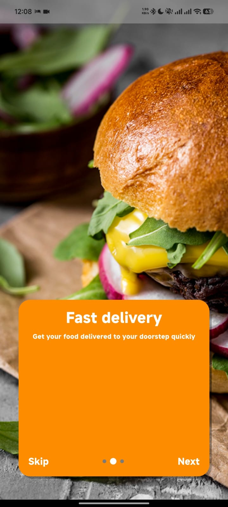
  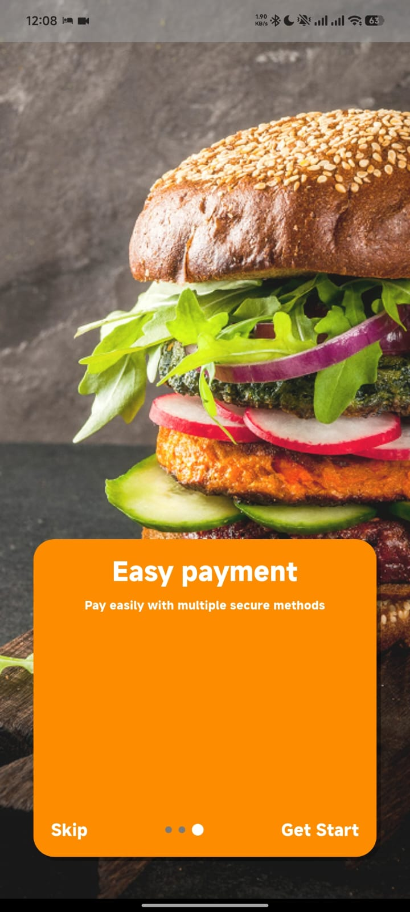
</p>

### Main Features

#### Home Page

<p align="center">
  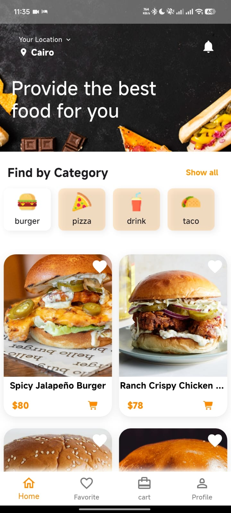
</p>

#### Favorite Page

<p>
  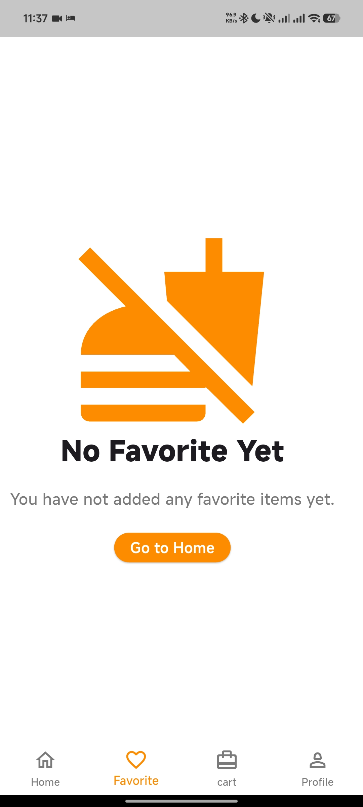
  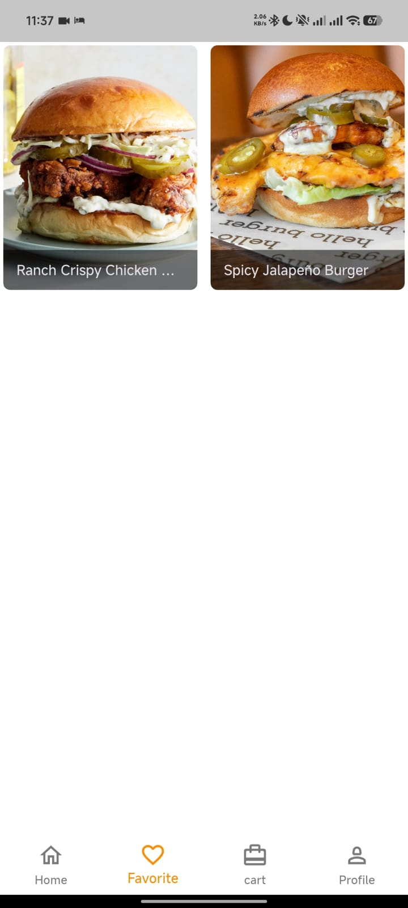
</p>

#### Cart page

<p align="center">
  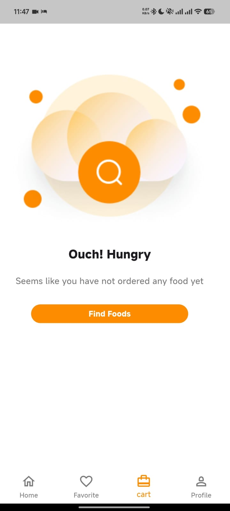
  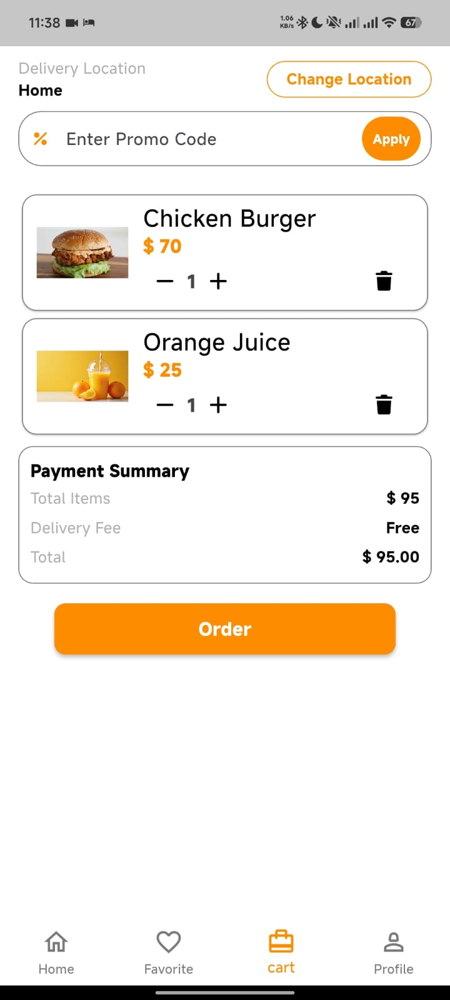
</p>

#### Profile page

<p align="center">
  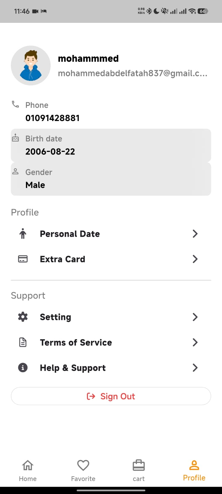
  
</p>


## 🚀 Features

### 🔐 Authentication Module

**Location:** `lib/features/auth/`

**Functionality:**

- Email & Password Registration/Login
- Google Sign-In (OAuth)
- Email Verification
- OTP Verification
- Password Reset
- Secure session management

**Screenshots:**

<p align="center">
  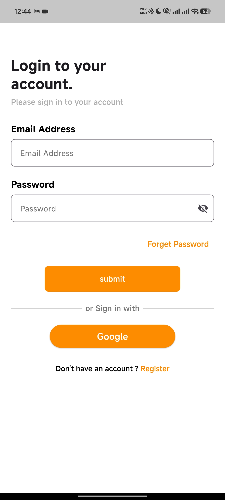
  
  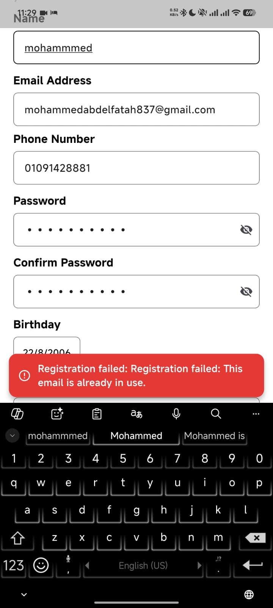
  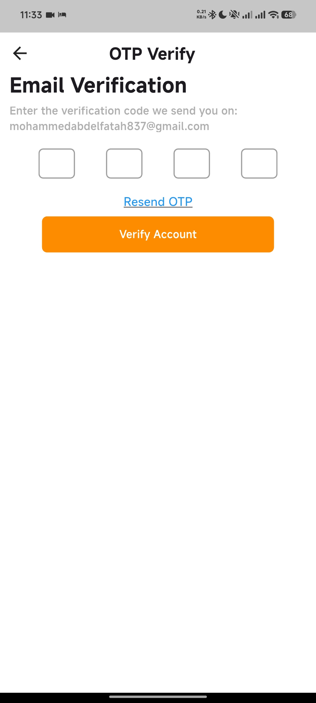
  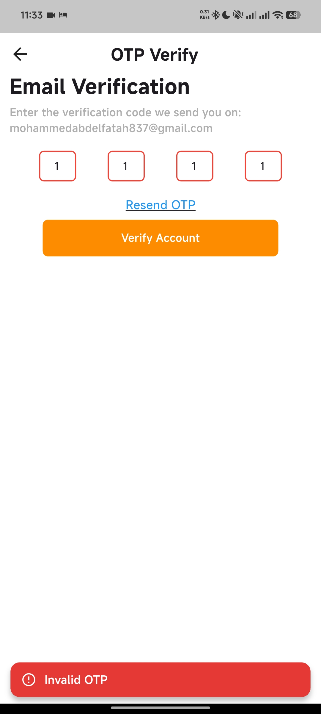
  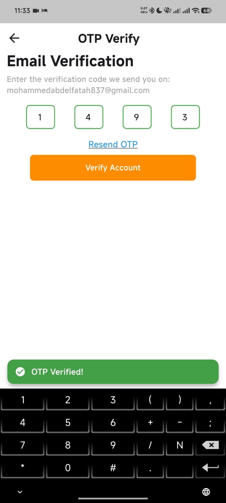
  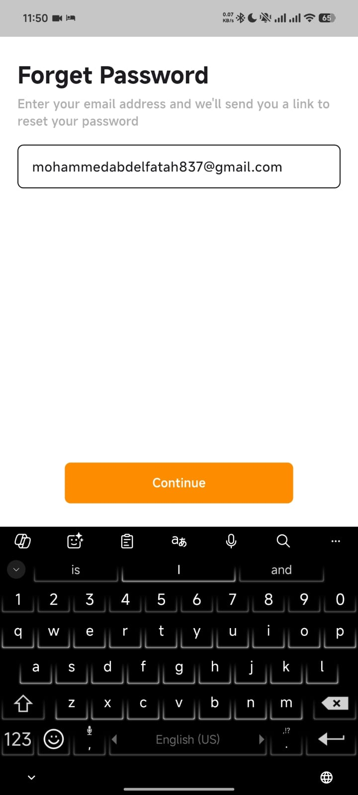
  
  </p>

**Video Demo:**

```
🎥 [TODO Add Authentication Flow Video]
```


### 🏠 Home Module

**Location:** `lib/features/home/`

**Functionality:**

- Featured products display
- Product categories browsing
- Search functionality
- Product filtering and sorting
- Real-time product updates
- Product details view

**Screenshots:**

<p align="center">
  
  
  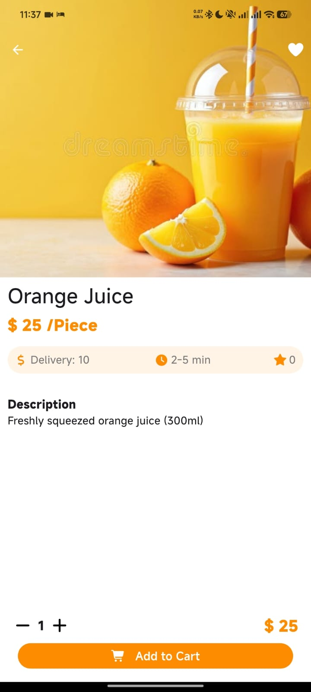
</p>

---

### 🛒 Cart Module

**Location:** `lib/features/cart/`

**Functionality:**

- Add items to cart
- Update item quantities
- Remove items from cart
- Cart total calculation
- Real-time cart updates
- Cart persistence

**Screenshots:**

<p align="center">
  
  
  
</p>

---

### ❤️ Favorite Module

**Location:** `lib/features/favorite/`

**Functionality:**

- Add products to favorites
- View favorite items list
- Quick access to favorite products
- Favorite persistence

**Screenshots:**

<p align="center">
  
  
</p>

---

### 👤 Profile Module

**Location:** `lib/features/profile/`

**Functionality:**

- User profile management
- Edit personal information
- Profile picture upload
- Account settings
- Address management

**Screenshots:**

<p align="center">
  
  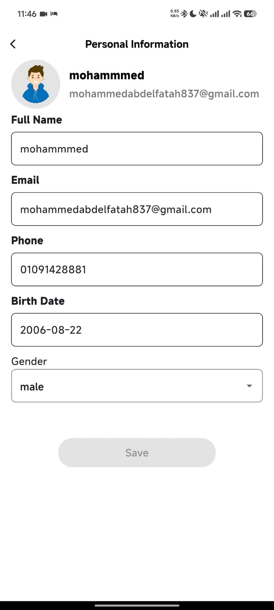
  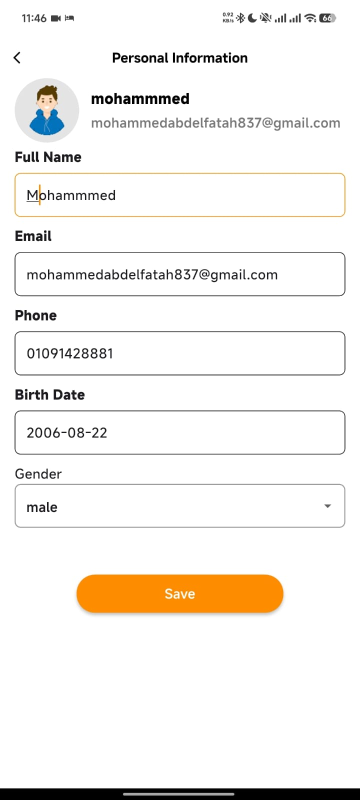
  
</p>

---

### � Notification Module

**Location:** `lib/features/notification/`

**Functionality:**

- Push notifications
- In-app notifications
- Notification history
- Notification preferences
- Order status updates
- Promotional notifications

**Screenshots:**

<p align="center">
  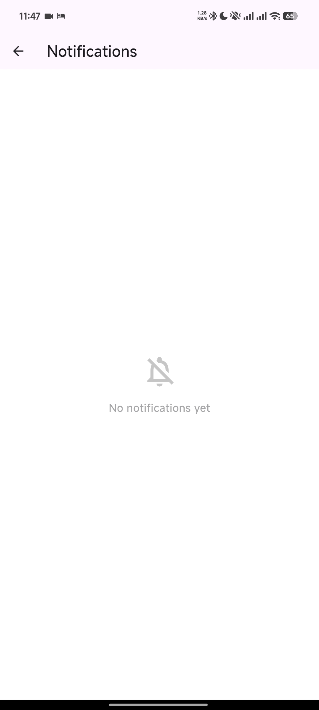
  
  
</p>

---

### 💳 Payment Module

**Location:** `lib/features/payment/`

**Functionality:**

- Payment method selection
- Credit/Debit card management
- Digital wallet integration
- Payment history
- Secure payment processing

**Screenshots:**

<p align="center">
  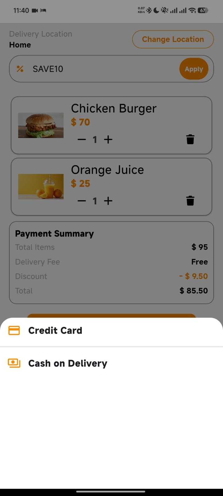
  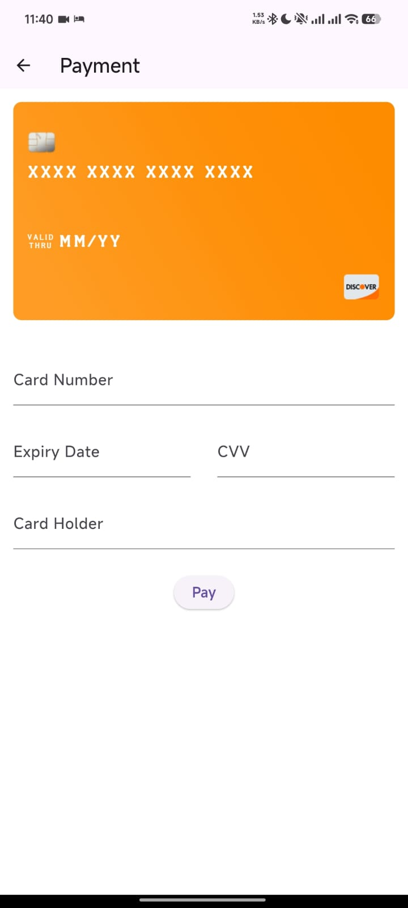
  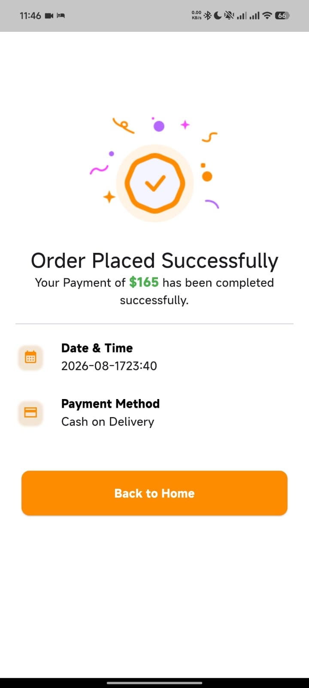
</p>

---

### 📐 Layout Module

**Location:** `lib/features/layout/`

**Functionality:**

- Bottom navigation bar
- App shell structure
- Navigation between modules
- Responsive layout management

---

## 📥 Download Application

You can download and try the app directly from here:

👉 **[Download FoodDelivery App](https://drive.google.com/file/d/1m3TSG9BmoJuQWTdh9w11Y2evH9_NwX2Q/view?usp=sharing)**

> Make sure to allow installation from unknown sources on your Android device.

---

## 🛠️ Tech Stack

### Framework

- Flutter (SDK ^3.7.2)

### State Management

- bloc
- flutter_bloc

### Backend (Firebase)

- firebase_core
- firebase_auth
- cloud_firestore
- firebase_messaging

### Utilities & UI

- flutter_screenutil
- cached_network_image
- font_awesome_flutter
- cupertino_icons

### Storage & Data

- shared_preferences
- path_provider

### Architecture Tools

- get_it (Dependency Injection)
- dartz (Functional Programming)
- equatable (Value Equality)

### Dev Tools

- flutter_lints
- flutter_test
- flutter_launcher_icons

---

## 🏗️ Project Structure

```
lib/
├── core/
│   ├── colors/
│   ├── constants/
│   ├── di/
│   ├── mail/
│   ├── models/
│   ├── router/
│   ├── services/
│   ├── shared/
│   ├── style/
│   ├── utils/
│   └── widgets/
│
├── features/
│   ├── auth/
│   │   ├── data/
│   │   ├── domain/
│   │   └── presentation/
│   ├── bottom_nav_bar/
│   ├── cart/
│   ├── home/
│   ├── onboarding/
│   └── profile/
│
├── firebase_options.dart
├── main.dart
└── my_app.dart
```

---

## 🏛️ Architecture

This project follows **Clean Architecture**, separating concerns into three layers:

### 🔹 Presentation Layer

- UI (Widgets)
- BLoC (State Management)

### 🔹 Domain Layer

- Entities
- Use Cases
- Repository Interfaces

### 🔹 Data Layer

- Models
- Repository Implementations
- Data Sources (Firebase, Local Storage)

```
┌─────────────────────────────────────────────────────────────┐
│                    Presentation Layer                       │
│  ┌─────────────┐  ┌─────────────┐  ┌─────────────────────┐  │
│  │   Widgets   │  │   BLoC      │  │   Views/States      │  │
│  └─────────────┘  └─────────────┘  └─────────────────────┘  │
└─────────────────────────────────────────────────────────────┘
                              │
                              ▼
┌─────────────────────────────────────────────────────────────┐
│                     Domain Layer                            │
│  ┌─────────────┐  ┌─────────────┐  ┌─────────────────────┐  │
│  │  Entities   │  │ Use Cases   │  │   Repositories      │  │
│  └─────────────┘  └─────────────┘  └─────────────────────┘  │
└─────────────────────────────────────────────────────────────┘
                              │
                              ▼
┌─────────────────────────────────────────────────────────────┐
│                      Data Layer                             │
│  ┌─────────────┐  ┌─────────────┐  ┌─────────────────────┐  │
│  │ Data Models │  │ Repositories│  │   Data Sources      │  │
│  └─────────────┘  └─────────────┘  └─────────────────────┘  │
└─────────────────────────────────────────────────────────────┘
```

---

## 🔄 Data Flow

1. User interacts with UI
2. Event sent to BLoC
3. BLoC calls Use Case
4. Use Case accesses Repository
5. Repository fetches data from sources
6. BLoC emits new state
7. UI rebuilds

---

## 🚀 Getting Started

### Prerequisites

- Flutter SDK ^3.7.2
- Firebase Project

---

### Installation

```bash
git clone https://github.com/MohammedAbdElfatah0/Food-Delivery
cd food_delivery
flutter pub get
```

---

### Firebase Setup

1. Create a Firebase project
2. Add Android & iOS apps
3. Download config files:
   - `google-services.json` → android/app/
   - `GoogleService-Info.plist` → ios/Runner/

---

### Environment Variables

Create:

```
assets/.env
```

Add your Firebase configuration.

---

### Run App

```bash
flutter run
```

---

## 📱 Platform Support

- ✅ Android
- ✅ iOS
- ⚠️ Web (limited)
- ⚠️ Windows / Linux / macOS (limited)

---

## 🧪 Testing

```bash
flutter test
```

---

## 🏗️ Build

```bash
# Android
flutter build apk --release

# iOS
flutter build ios --release
```

## 🤝 Contributing

1. Fork the repository
2. Create a feature branch
3. Commit changes
4. Push and open a Pull Request

---

## 📬 Contact

- WhatsApp: +20 10 91428881
- LinkedIn: https://www.linkedin.com/in/mohamed-mohamed-abd-el-fatah-a276ab264/
- Email: mohammedabdelfatah837@gmail.com
